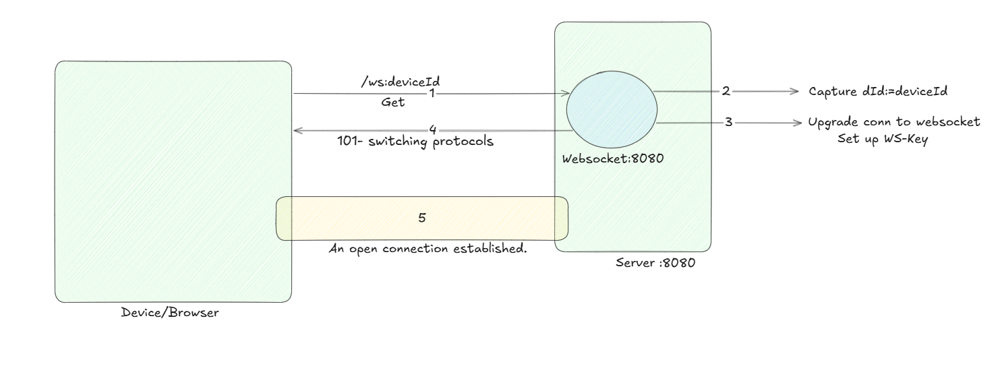

## What is a WebSocket?
A WebSocket is a persistent, full-duplex connection between client and server over a single TCP connection — unlike HTTP which is request/response based.
-   You send a message from client → server without making a new request.
-   Server can push data to client at any time, without being asked.


## How does it start? (The WebSocket handshake)
The connection starts as a normal HTTP request:

```
GET /ws?deviceID=abc123 HTTP/1.1
Upgrade: websocket
Connection: Upgrade
Sec-WebSocket-Key: ...
```
Then the server responds with:

```
HTTP/1.1 101 Switching Protocols
Upgrade: websocket
Connection: Upgrade
```
This “Upgrade” handshake is what gorilla/websocket.Upgrader does for us under the hood.

## What does gorilla/websocket do?
It:

- Upgrades the net/http request to a WebSocket connection.

- Provides helper functions:
    -   ReadMessage() → reads one complete message from the client.
    -   WriteMessage() → sends a message to the client.

-   Abstracts frames, opcodes, and low-level socket operations.

## Why defer conn.Close()?
To gracefully close the connection when the function ends:

```go
defer conn.Close()
```
This ensures:

-   Connection is closed if client disconnects or server throws an error.
-   No memory leaks.

## What is mt in ReadMessage()?
```go
mt, msg, err := conn.ReadMessage()
```
mt = message type, like:

-   1 → text

-   2 → binary

-   9 → ping

-   10 → pong

You echo the message type back to preserve its meaning.


## Basic WS Flow



Sure! Here's a simple **story-style explanation** for Steps 1–5 in your WebSocket diagram — like a scene from a tech movie:

---

### 🧙‍♂️ **The Tale of the Curious Device and the WebSocket Gatekeeper**

---

#### **Step 1: The Knock on the Gate**

One day, a Device (let’s say a browser-based agent) walks up to a grand gate at `ws://server:8080/ws?deviceId=abc123` and knocks politely.

> 📣 *“Hello, I’d like to enter. Here’s my ID — ‘abc123’.”*

It sends an HTTP GET request to the server’s `/ws` endpoint with its unique `deviceId`.

---

#### **Step 2: The Gatekeeper Checks the Identity**

Inside the server, a **gatekeeper** wakes up. It takes a peek at the visitor and notes:

> 🤔 *“Hmm… this device says it’s ‘abc123’. Noted. Let me verify and prepare.”*

The gatekeeper captures and logs the `deviceId` — this will be important for sending messages to this specific guest later.

---

#### **Step 3: Secret Handshake Begins**

The device and server don’t just talk in regular language — they need a **secret channel**. So the gatekeeper responds:

> 🔐 *“I accept your request… let’s upgrade this boring HTTP connection to something magical: a WebSocket.”*

It includes a special key (`Sec-WebSocket-Key`) to set up the secure, full-duplex channel.

---

#### **Step 4: The Switch Happens**

If all goes well, the server sends back:

> 🧾 *“101 – Switching Protocols. Welcome, we now speak WebSocket.”*

At this point, the connection transforms — like shifting from email to live chat.

---

#### **Step 5: Friendship Formed – Connection Established**

Now the device and server are best friends.

> 🔁 They can send messages to each other at any time, no more knocking, no more waiting.
>
> The line is open — always listening, always talking — until one of them says goodbye.

---

